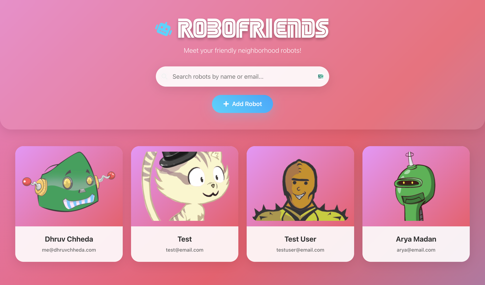
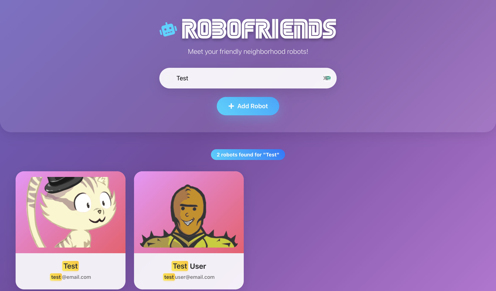
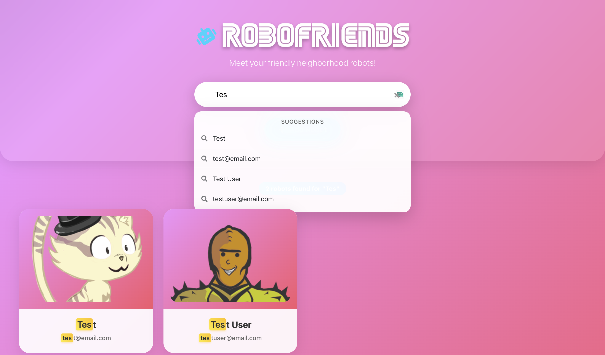
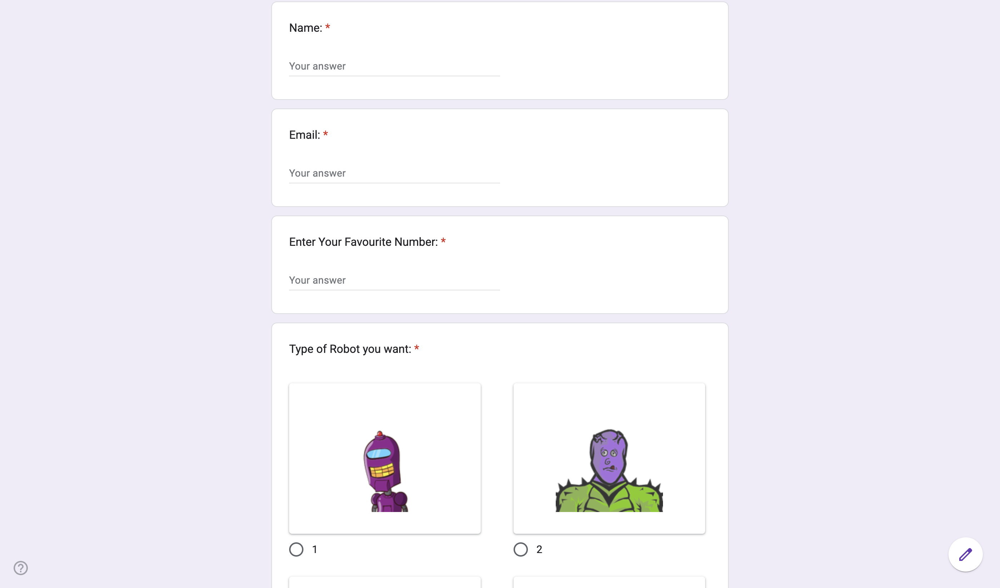

# RoboFriends 🤖

A modern, interactive React-based web application that showcases a collection of unique robot friends with smart search capabilities and beautiful UI animations.

## 🌟 Features

- **Interactive Robot Gallery**: Browse through a collection of unique robot cards with personalized avatars
- **Smart Search**: Advanced search functionality with:
  - Real-time search suggestions
  - Fuzzy matching for typos
  - Search highlighting in results
  - Recent search history
  - Multi-term search support
- **Add New Robots**: Integrated Google Form to submit new robot entries
- **Responsive Design**: Fully responsive layout that works on all devices
- **Modern UI**: Beautiful animations, loading states, and error handling
- **Performance Optimized**: Debounced search, memoized components, and efficient rendering

## 🚀 Live Demo

Visit the live application: [robofriends.dhruvchheda.com](https://robofriends.dhruvchheda.com)

## 📸 Screenshots

| Home Page | Search Results | Search Suggestions | Add Robot Form |
|-----------|----------------|-------------------|----------------|
|  |  |  |  |

## 🛠️ Installation

1. **Clone the repository:**
   ```bash
   git clone https://github.com/chhedadhruv/Robofriends.git
   cd Robofriends
   ```

2. **Install dependencies:**
   ```bash
   npm install
   ```

3. **Set up environment variables:**
   Create a `.env` file in the root directory with the following variables:
   ```env
   REACT_APP_ROBOTS_API_URL=your_google_sheets_api_url
   REACT_APP_ADD_ROBOT_FORM_URL=your_google_form_url
   REACT_APP_ROBOHASH_API_URL=https://robohash.org
   ```

4. **Start the development server:**
   ```bash
   npm start
   ```

5. **Open your browser:**
   Navigate to [http://localhost:3000](http://localhost:3000) to view the application.

## 🎯 Usage

### Browsing Robots
- View all robot friends displayed as cards with unique avatars
- Each card shows the robot's name, email, and personalized image

### Searching
- Use the search bar to find robots by name or email
- Get real-time suggestions as you type
- View search history for quick access to previous searches
- Search supports multiple terms and fuzzy matching

### Adding New Robots
- Click the "Add Robot" button to open the Google Form
- Fill in the robot details (name, email, etc.)
- Submitted robots will appear in the gallery after processing

## 🏗️ Project Structure

```
src/
├── App.js          # Main application component
├── App.css         # Styling and animations
├── index.js        # React DOM rendering
├── SEGA.woff       # Custom font file
└── reportWebVitals.js
```

## 🧪 Technologies Used

- **Frontend Framework**: React 18
- **UI Library**: React Bootstrap 5
- **Icons**: React Icons (Font Awesome)
- **Styling**: Custom CSS with Bootstrap
- **API Integration**: Google Sheets API for data
- **Robot Generation**: [Robohash.org](https://robohash.org/)

## 📦 Dependencies

- `react` & `react-dom` - Core React framework
- `react-bootstrap` & `bootstrap` - UI components and styling
- `react-icons` - Icon library

## 🔧 Development Features

- **Performance Optimizations**:
  - Debounced search input (300ms delay)
  - Memoized search results and suggestions
  - Optimized re-renders with useCallback hooks

- **User Experience**:
  - Loading spinners and error states
  - Smooth animations and transitions
  - Responsive grid layout
  - Search result highlighting

- **Code Quality**:
  - Modern React hooks and functional components
  - Clean component architecture
  - Proper error handling and loading states

## 👨‍💻 Author

**Dhruv Chheda**
- GitHub: [@chhedadhruv](https://github.com/chhedadhruv)
- Website: [dhruvchheda.com](https://dhruvchheda.com)

## 🙏 Acknowledgments

- [Robohash.org](https://robohash.org/) for providing the robot avatar generation service
- React Bootstrap team for the excellent UI components
- The React community for the amazing ecosystem